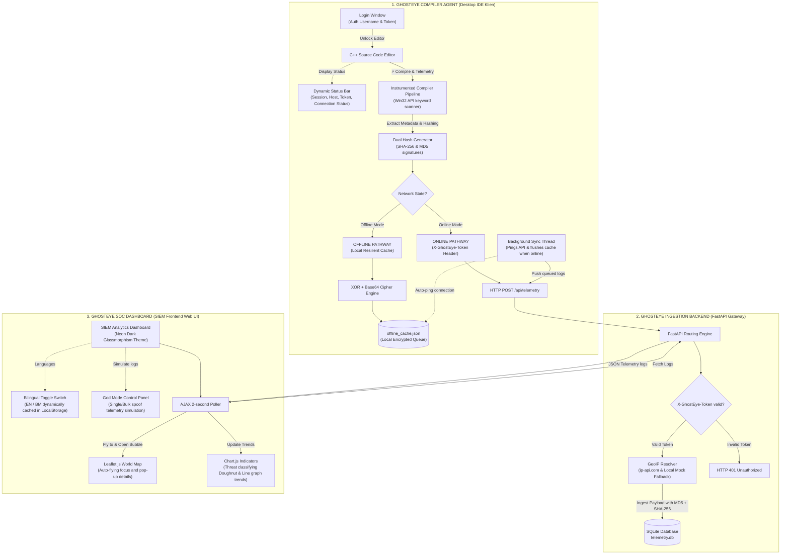
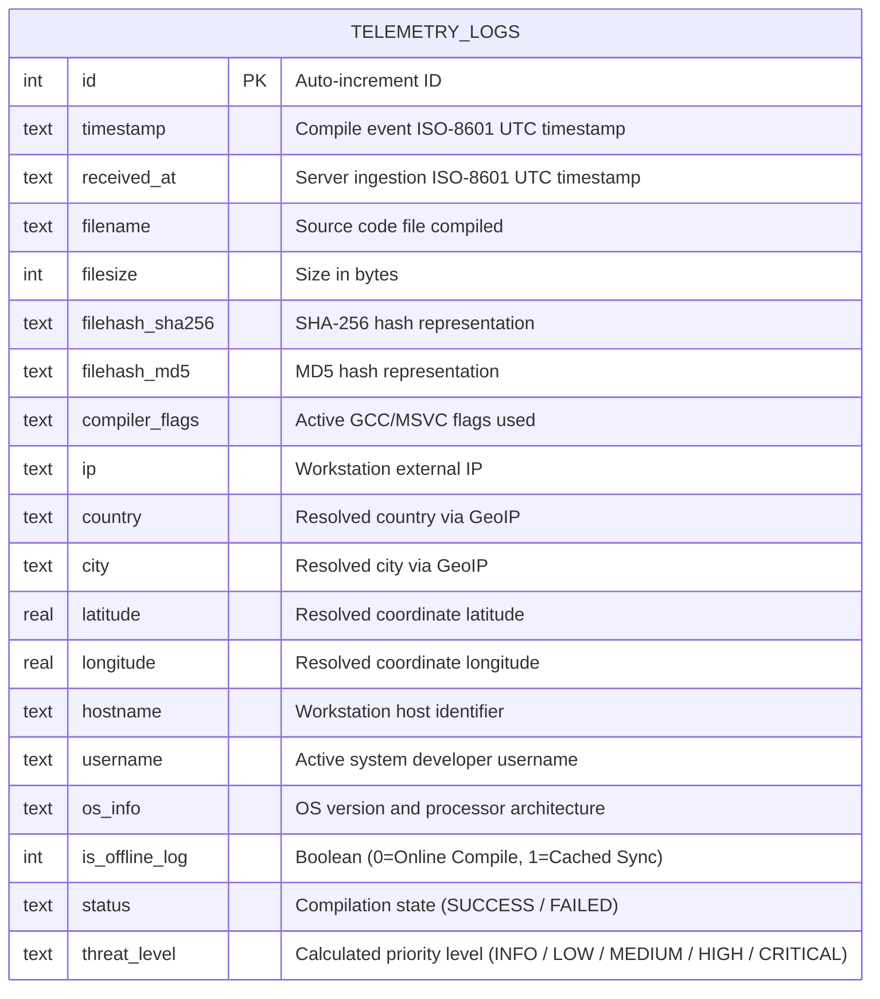
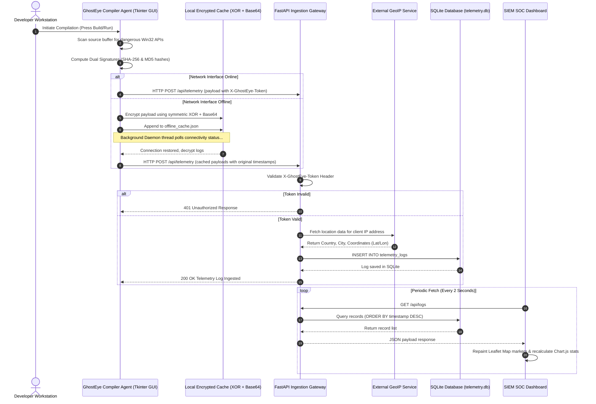

# Project Proposal: GHOSTEYE 👁️
> **Instrumented Compiler-Level Threat Intelligence & Real-time SIEM Telemetry Ingestion Gateway**

* **Author:** Yamani Sofyan
* **Role / Perspective:** Security Architect
* **Project Type:** Cybersecurity Final Year Project (FYP) / Proof-of-Concept (PoC)

---

## 📄 Executive Summary

Traditional detection mechanisms (such as EDR, Antivirus, and Sandbox analysis) operate downstream—analyzing compiled executables, installer packages, or running processes. At this post-compilation stage, advanced adversaries routinely bypass detection using obfuscators, packers, and crypters. 

**GhostEye** introduces a **"Shift-Left" security pipeline** by instrumenting the compilation process directly at the developer's workstation. By collecting rich compilation telemetry (timestamp, username, hostname, OS specifications, external IP, compiler flags, and dual cryptographic signatures—MD5 and SHA-256) and immediately streaming it to a Security Operations Center (SOC) SIEM Dashboard, security teams gain immediate, centralized visibility into software builds before any executable is deployed or packed.

---

## 1. Problem Statement

1. **Delayed Detection ("Downstream Vulnerability"):** Most malware signatures and behaviors are only analyzed post-compilation. If a developer compiles a malicious payload or a compromised dependency on their local workstation, traditional security tools do not alert until execution or file scan, which is often too late.
2. **Obfuscation and Anti-Analysis Bypass:** Threat actors easily bypass static EDR signature checks by packing or encrypting binaries immediately after compile time. By monitoring the build pipeline *during* code emission, the original source structure can be assessed.
3. **Lack of Local Build Auditing:** In modern dev environments, security teams have minimal visibility into what code developers are compiling locally. Compromised developer machines compiling backdoors go unnoticed.
4. **Resiliency in Air-gapped or Intermittent Network States:** Traditional log dispatchers drop data or freeze if connection to the SOC server is lost. GhostEye addresses this with a resilient local caching system that protects data integrity offline without exposing plaintext telemetry logs on the local filesystem.

---

## 2. Project Objectives

* **Objective 1:** Design and develop a custom **Instrumented Compiler Agent (Mini-IDE)** that parses source code for suspicious Win32 API calls (e.g. process injection keywords like `VirtualAllocEx`, `WriteProcessMemory`, `CreateRemoteThread`) during compilation.
* **Objective 2:** Implement a **Dual Cryptographic Signature Generator** producing both legacy **MD5** and collision-resistant **SHA-256** signatures of the code bytes to be stored in telemetry.
* **Objective 3:** Build a **Resilient Offline Caching Engine** using an **XOR + Base64** cryptographic cipher to write logs into `offline_cache.json` during network outages, syncing logs automatically with preserved original timestamps once connection is restored.
* **Objective 4:** Develop a centralized **FastAPI Ingestion Server** securing requests with `X-GhostEye-Token` API key verification, resolving geolocations via GeoIP, and saving entries in an SQLite database.
* **Objective 5:** Deploy an interactive **SIEM Operations Dashboard** utilizing Leaflet.js world maps for geographic plot panning, and Chart.js for real-time threat categorization.

---

## 3. System Architecture & Methodology

GhostEye utilizes a 3-tier architecture: the Client IDE Agent, the FastAPI Backend Gateway, and the Web SIEM Frontend.

### 🗃️ 3.1 Database Entity-Relationship Diagram (ERD)

The telemetry database schema is designed to support detailed host forensics, build status tracking, threat classification, and geographical tracing in SQLite.

### 🔄 3.2 System Sequence Diagram

This sequence diagram illustrates the automated compiler-level intercept, cryptographic dual hashing, offline-sync path, backend authorization, GeoIP lookup, and dashboard visualization lifecycle.

---

## 4. Key Security Designs

### 🔑 A. Dual Hash Signatures
The compiler agent generates two hashes simultaneously from the code buffer:
* **MD5 Hashing:** Computed via `hashlib.md5().hexdigest()`. Ideal for cross-referencing against threat databases like VirusTotal or legacy threat intelligence platforms.
* **SHA-256 Hashing:** Computed via `hashlib.sha256().hexdigest()`. Standard for collision-resistant binary representation.

### 🌐 B. Resilient Offline Caching (XOR + Base64)
If the compiler agent is unable to reach the API server:
1. The payload is JSON-serialized.
2. The serialized payload is encrypted with a custom symmetric XOR cipher using a hardcoded key.
3. The raw XOR bytes are Base64 encoded using `latin1` to prevent character set decoding issues.
4. The output is written to `offline_cache.json`.
5. A background daemon thread periodically pings the server. When online connectivity is re-established, the cache is read, decrypted, parsed, and posted to the backend API, preserving the original compile timestamps.

### 🔒 C. Ingestion API Authentication
The FastAPI backend validates the HTTP header `X-GhostEye-Token`. If the token is absent or invalid, the request returns a `401 Unauthorized` response, preventing log spoofing or database pollution from unauthorized sources.

---

## 5. Scope of Simulation (Demonstration / Evaluation)

To ensure the viability of the academic demonstration, the project implements a **"God Mode" Spoofing Control Panel**:
1. **IP & Country Spoofing:** Spoof developer workstations compiling from restricted regions (e.g. Russia, China, North Korea) to show how geo-location threat analysis maps trigger indicators.
2. **Bulk Attacks Simulation:** A single-button simulation trigger that emits 10 distinct, globally-distributed compiler events sequentially, creating active visual feedback on the SIEM Leaflet map.
3. **Database Reset Option:** For clearing log tables in preparation for live panel evaluation.

---

## 6. Project Deliverables

* **Source Code Directory:** Contains the Python `server.py` backend, `compiler_agent.py` client agent, `dashboard.js` logic, and `index.html` frontend.
* **Database File:** `telemetry.db` containing SQLite telemetry table models.
* **Architecture Map:** Detailed flowchart diagrams (`ghosteye_architecture.png`) for presentation slide attachments.
* **License Charter:** `LICENSE` file setting out proprietary copyright restrictions for the intellectual property.
