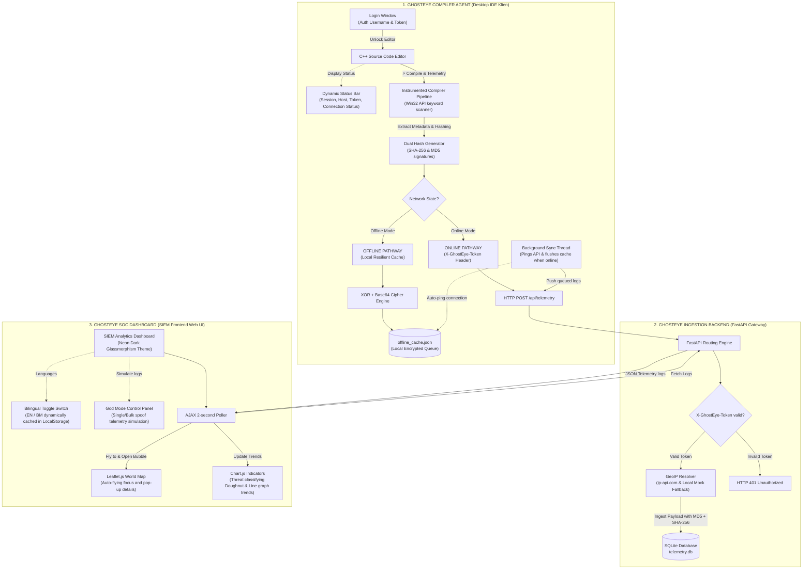
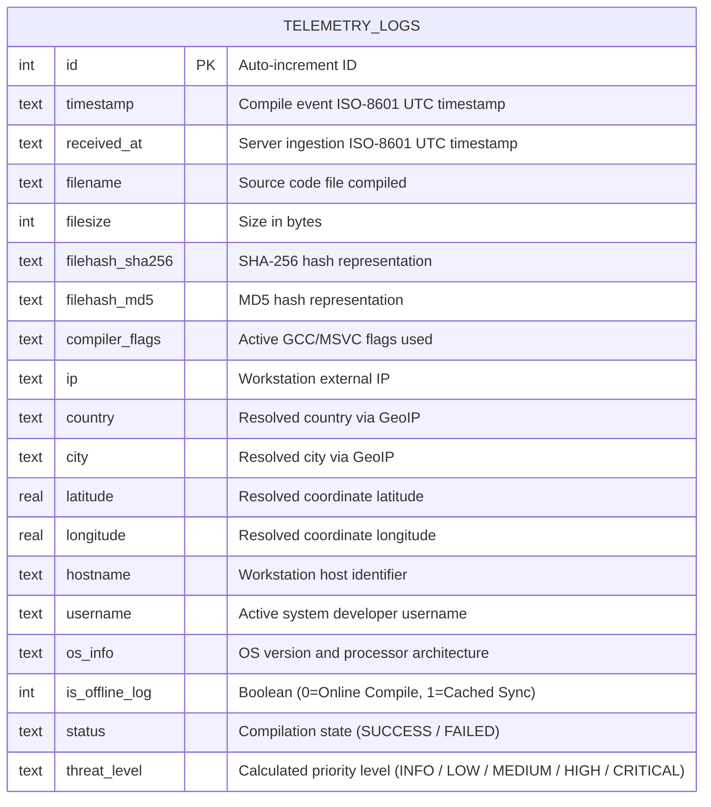
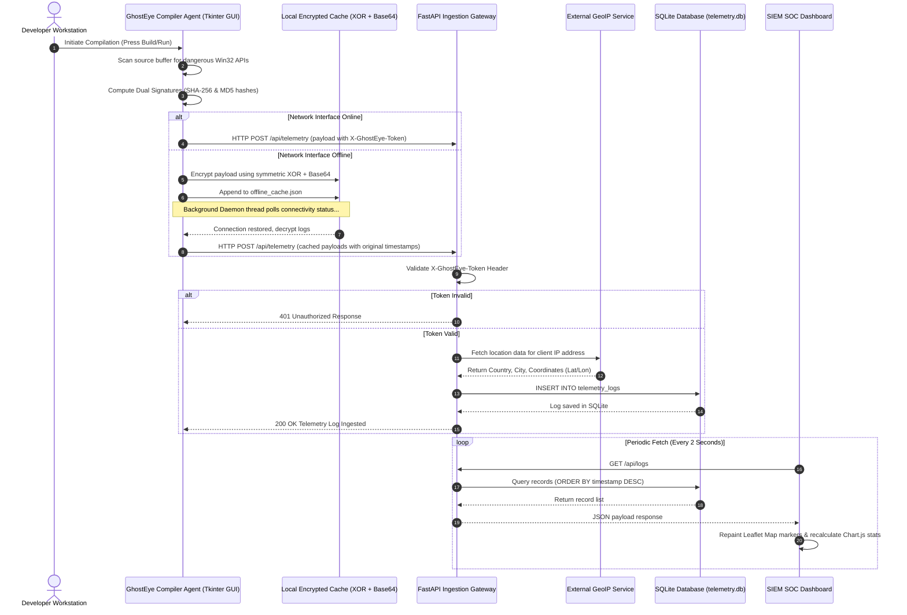

# GhostEye 👁️
> **Compiler-Level Threat Intelligence & Telemetry Ingestion Simulator**

GhostEye is an experimental cybersecurity proof-of-concept (PoC) designed to demonstrate **"Shift-Left" security** in software development pipelines. Instead of relying on traditional static or dynamic analysis *after* a binary is created, GhostEye instruments the compilation process itself. 

Whenever a developer compiles code, the GhostEye Compiler Agent intercepts the event, gathers rich system/file metadata (timestamps, OS details, username, geolocation, and hash characteristics), and streams it directly to a centralized SOC SIEM Dashboard.

---

## 🏗️ System Architecture & Workflow

GhostEye operates with a decoupled client-server architecture containing dual signature compilation, resilient caching for offline states, token authorization, and real-time visualization.

### 📊 System Architecture Diagram



### 🗃️ Database Entity-Relationship Diagram (ERD)



### 🔄 System Sequence Diagram



---

### 🔐 Security Architecture Details

#### 1. Dual Hashes Signatures (MD5 & SHA-256)
During the instrumented compilation process, the source code is passed to two independent hashing algorithms. Both signatures are generated and appended to the telemetry payload:
* **MD5 Hashing:** Captured via `hashlib.md5()` to maintain legacy compatibility and quick hash lookups in traditional databases.
* **SHA-256 Hashing:** Captured via `hashlib.sha256()` to offer cryptographic integrity and prevent signature collision attacks.

#### 2. Network Pathways: Online vs. Offline Mode

| Feature / Pathway | 🌐 Online Mode | 🔌 Offline Mode |
| :--- | :--- | :--- |
| **Transmission Destination** | Direct transmission to the FastAPI Backend Server. | Local caching in the `offline_cache.json` file. |
| **Authentication** | Validated via `X-GhostEye-Token` in the HTTP header. | Pre-validated signature; stored securely until connection is restored. |
| **Data Encryption** | Sent over HTTP (or HTTPS in production). | Cryptographically secured using an **XOR + Base64** cipher engine locally. |
| **Synchronisation** | Real-time ingest. | A background thread pings the API server and auto-flushes/syncs logs when the network becomes online. |

### Data Stream Flow:
1. **Developer Actions:** Developer writes code in the custom C++ IDE and clicks **Compile**.
2. **Telemetry Extraction:** The Compiler Agent immediately captures local timestamps, user account details, system hostname, OS specifications, and generates dual signatures (MD5 & SHA-256).
3. **Network Dispatching:** 
   * **If Online:** Dispatches telemetry via a secure HTTP POST JSON payload to the API server.
   * **If Offline:** Encrypts telemetry via XOR + Base64 and writes it to `offline_cache.json` with historical timestamps preserved. Once connection is restored, a background sync thread automatically flushes the queue.
4. **FastAPI Ingestion:** The backend verifies the API token, resolves client geolocations via GeoIP APIs (with simulated offline fallbacks), and commits records to a local SQLite database.
5. **Real-time Monitoring:** The SOC Dashboard pulls logs and updates analytics widgets, panning the Leaflet.js world map to the compile source coordinates and popping details in real-time.

---

## ⚡ Key Features

- **Instrumented Mini-IDE:** A dark-themed desktop code editor that parses source code dynamically for suspicious API calls (e.g., Win32 injection signatures) during compilation.
- **Real-Time Telemetry Stream:** Seamlessly transmits compilation events to a REST API. Records compile timestamp, hostname, OS details, username, compiler flags, and external IP.
- **Offline Caching & Auto-Sync:** Fully resilient compiler agent. If compilation occurs offline, telemetry is secured inside a local cache (`offline_cache.json`) with its original timestamp preserved. Once connection is restored, a background thread syncs the pending queue back to the SIEM.
- **"God Mode" Simulation Controls:** Built-in testing panel to spoof compiler host locations (e.g., Russia, China, North Korea, USA) and trigger bulk simulated logs to demonstrate SIEM alerts.
- **SOC SIEM Dashboard:** A sleek, glassmorphic dark-mode web dashboard featuring interactive world maps (Leaflet.js) and threat analytical metrics (Chart.js).

---

## 🏗️ Tech Stack

- **Frontend:** HTML5, Vanilla CSS3 (Glassmorphism), JavaScript (ES6+), **Chart.js** (Visuals), and **Leaflet.js** (World Map).
- **Backend:** **Python 3**, **FastAPI** (asynchronous routing), and **SQLite** (file-based database).
- **Compiler Agent:** Python **Tkinter** desktop framework.

---

## 🚀 How to Run Locally

### Prerequisites
Ensure you have Python 3 installed. Install dependencies using:
```bash
pip install fastapi uvicorn requests
```

### 1. Start the SIEM Dashboard & API Backend
Run the backend web server from the project directory:
```bash
python server.py
```
Open your browser and navigate to: [http://127.0.0.1:8000](http://127.0.0.1:8000)

### 2. Start the Compiler Agent Client
In a new terminal window, launch the compiler editor client:
```bash
python compiler_agent.py
```
Write or paste your code, choose your network status, and click **COMPILE & TELEMETRY**!
